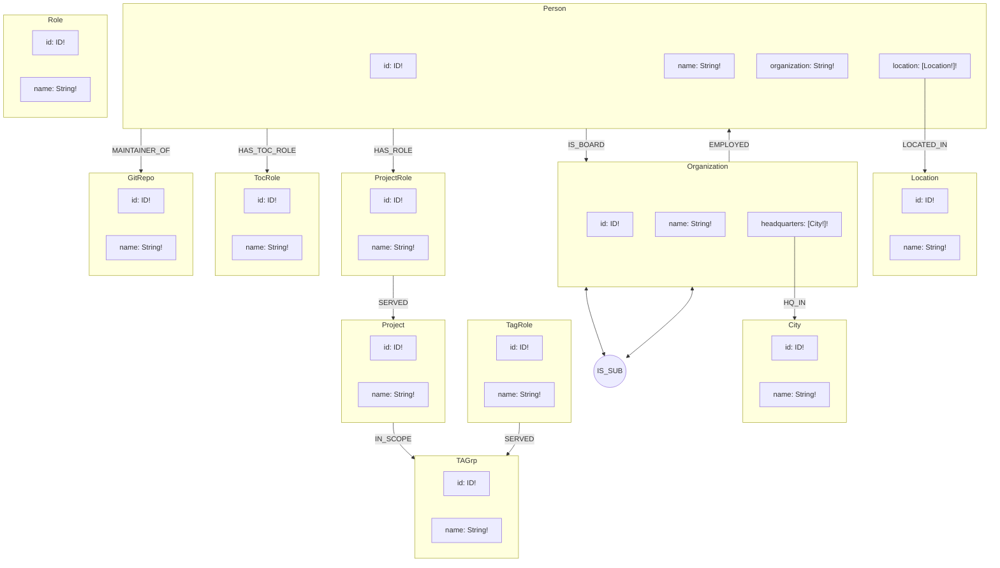

```mermaid
flowchart TB
    subgraph Person
    Person_id["id: ID!"]
    Person_name["name: String!"]
    Person_organization["organization: String!"]
    Person_location["location: [Location!]!"]
    end
    subgraph Role
    Role_id["id: ID!"]
    Role_name["name: String!"]
    end
    subgraph Organization
    Organization_id["id: ID!"]
    Organization_name["name: String!"]
    Organization_headquarters["headquarters: [City!]!"]
    end
    subgraph Location
    Location_id["id: ID!"]
    Location_name["name: String!"]
    end
    subgraph GitRepo
    GitRepo_id["id: ID!"]
    GitRepo_name["name: String!"]
    end
    subgraph TocRole
    TocRole_id["id: ID!"]
    TocRole_name["name: String!"]
    end
    subgraph Project
    Project_id["id: ID!"]
    Project_name["name: String!"]
    end
    subgraph ProjectRole
    ProjectRole_id["id: ID!"]
    ProjectRole_name["name: String!"]
    end
    subgraph TAGrp
    TAGrp_id["id: ID!"]
    TAGrp_name["name: String!"]
    end
    subgraph TagRole
    TagRole_id["id: ID!"]
    TagRole_name["name: String!"]
    end
    subgraph City
    City_id["id: ID!"]
    City_name["name: String!"]
    end
    Person_location -->|LOCATED_IN| Location
    Person -->|MAINTAINER_OF| GitRepo
    Person -->|HAS_TOC_ROLE| TocRole
    Person -->|HAS_ROLE| ProjectRole
    ProjectRole -->|SERVED| Project
    Project -->|IN_SCOPE| TAGrp
    TagRole -->|SERVED| TAGrp
    Organization_headquarters -->|HQ_IN| City
    %% Temporary fix to represent bidirectional linking. It seems GitHub doesn't support Mermaid's native bidirectional linking yet.
    Organization <--> node((IS_SUB)) <--> Organization
    Organization -->|EMPLOYED| Person
    Person -->|IS_BOARD| Organization
```
